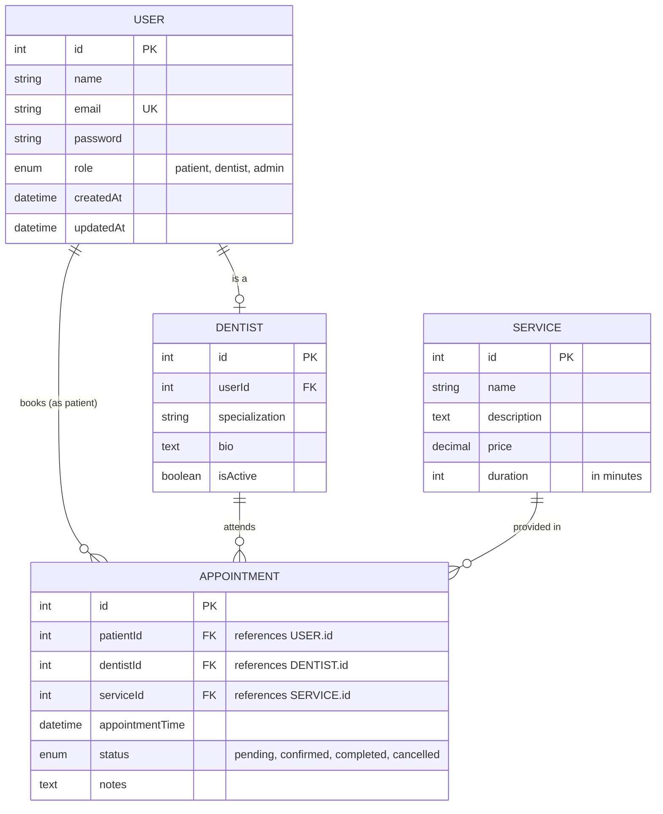

# Dental Appointment System - Database Design

## ERD (Entities and Relationships)



## SQL Schema (CREATE TABLE statements)

```sql
CREATE TABLE Users (
    id INT AUTO_INCREMENT PRIMARY KEY,
    name VARCHAR(255) NOT NULL,
    email VARCHAR(255) NOT NULL UNIQUE,
    password VARCHAR(255) NOT NULL,
    role ENUM('patient', 'dentist', 'admin') DEFAULT 'patient',
    createdAt DATETIME DEFAULT CURRENT_TIMESTAMP,
    updatedAt DATETIME DEFAULT CURRENT_TIMESTAMP ON UPDATE CURRENT_TIMESTAMP,
    INDEX (email)
);

CREATE TABLE Dentists (
    id INT AUTO_INCREMENT PRIMARY KEY,
    userId INT NOT NULL,
    specialization VARCHAR(255),
    bio TEXT,
    isActive BOOLEAN DEFAULT TRUE,
    FOREIGN KEY (userId) REFERENCES Users(id) ON DELETE CASCADE,
    INDEX (userId)
);

CREATE TABLE Services (
    id INT AUTO_INCREMENT PRIMARY KEY,
    name VARCHAR(255) NOT NULL,
    description TEXT,
    price DECIMAL(10, 2) NOT NULL,
    duration INT NOT NULL DEFAULT 30,
    createdAt DATETIME DEFAULT CURRENT_TIMESTAMP,
    updatedAt DATETIME DEFAULT CURRENT_TIMESTAMP ON UPDATE CURRENT_TIMESTAMP
);

CREATE TABLE Appointments (
    id INT AUTO_INCREMENT PRIMARY KEY,
    patientId INT NOT NULL,
    dentistId INT NOT NULL,
    serviceId INT NOT NULL,
    appointmentTime DATETIME NOT NULL,
    status ENUM('pending', 'confirmed', 'completed', 'cancelled') DEFAULT 'pending',
    notes TEXT,
    createdAt DATETIME DEFAULT CURRENT_TIMESTAMP,
    updatedAt DATETIME DEFAULT CURRENT_TIMESTAMP ON UPDATE CURRENT_TIMESTAMP,
    FOREIGN KEY (patientId) REFERENCES Users(id) ON DELETE CASCADE,
    FOREIGN KEY (dentistId) REFERENCES Dentists(id) ON DELETE CASCADE,
    FOREIGN KEY (serviceId) REFERENCES Services(id) ON DELETE CASCADE,
    INDEX (appointmentTime),
    INDEX (patientId),
    INDEX (dentistId)
);
```
